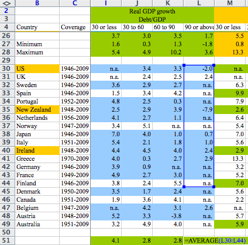
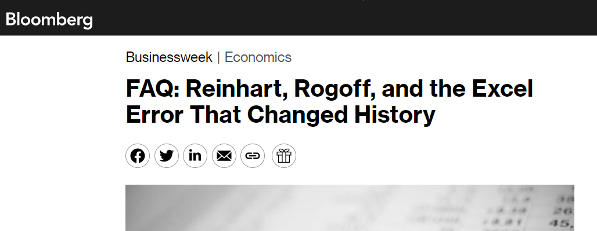

# Case Study: Is There A Reproducibility Crisis In Finance?

## What is reproducibility?

How the Turing Way defines reproducible research: https://the-turing-way.netlify.app/reproducible-research/overview/overview-definitions (Used under a CC-BY 4.0 license.)


## Reproducibility Crisis

### Significance Testing

Recently, various fields, especially in psychology and biomedical sciences, have faced a "reproducibility crisis." 
John Ioannidis' paper "Why Most Published Research Findings Are False" is highly influential paper published in 2005 that is credited with founding the field of "metascience". Wikipedia summarizes it as follows:

> In the paper, Ioannidis argued that a large number, if not the majority, of published medical research papers contain results that cannot be replicated. In simple terms, the essay states that scientists use hypothesis testing to determine whether scientific discoveries are significant. Statistical significance is formalized in terms of probability, with its p-value measure being reported in the scientific literature as a screening mechanism. Ioannidis posited assumptions about the way people perform and report these tests; then he constructed a statistical model which indicates that most published findings are likely false positive results.

The key argument of the paper is that this "screening mechanism" leads to erroneous significance testing. This is illustrated nicely by XKCD:


### Simple Typos

However, there are many other ways which may lead a paper to fail to replicate. For example, this can happen with simple coding errors. And this does happen more often than you would think!
One particularly [famous incident](https://www.bloomberg.com/news/articles/2013-04-18/faq-reinhart-rogoff-and-the-excel-error-that-changed-history) involved famous economists Carmen Reinhart and Kenneth Rogoff. A coding error was discovered in their influential paper "Growth in a Time of Debt." This error, a simple spreadsheet miscalculation, significantly impacted their results, which had previously suggested a clear negative correlation between high public debt and economic growth. This discovery was significant as it challenged the paper's conclusions, which had been influential in shaping economic policy debates, particularly around the impacts of government debt on economic growth.
At the time, this paper was held up as evidence in favor of austerity measures proposed at the time in 2013.  The incident highlighted the importance of data accuracy and transparency in economic research.



(Image from [here](https://statmodeling.stat.columbia.edu/2013/04/16/memo-to-reinhart-and-rogoff-i-think-its-best-to-admit-your-errors-and-go-on-from-there/))




## Is There a Replication Crisis in Finance?
```{admonition} Discussion
:class: note 
Finance, unlike fields like psychology, do not rely on clinical experiments. It relies on data that is, to a large degree, open to anyone to use. Would we expect there to be a reproducibility crisis in finance, given that everybody is using the same data? 
```

The following is actually a very recent example of a failure to replicate due to simple errors.
**[Bloomberg:](https://www.bloomberg.com/news/articles/2023-12-01/a-grad-school-number-cruncher-shakes-up-the-world-of-bond-quants ) A Grad-School Number-Cruncher Shakes Up the World of Bond Quants---Professors retract seminal finance paper after detective work uncovers flaws**


In this case, Alex Dickerson, a doctoral student, uncovered flaws in a seminal finance paper by Georgetown University professors, which had been influential in bond quantitative analysis. His work led to the retraction of [this paper](https://www.sciencedirect.com/science/article/pii/S0304405X18302095) from the Journal of Financial Economics, one of the top five journals in finance and a first for the journal. Dickerson identified errors in data alignment and removal of extreme losses in bonds, which invalidated the original paper's conclusions about predictive factors in the bond market. This discovery has significant implications for the field of finance, challenging the reliability of many accepted theories and methodologies.

The retracted paper was important because it provided a framework for identifying predictive factors in bond markets, a key aspect for quantitative investing. Its findings were seen as groundbreaking, influencing numerous strategies and research in finance. The retraction of such a seminal work signifies a major shift in understanding these factors, impacting both academic research and practical investment strategies in the bond market. This calls into question the reliability of established methodologies and theories in the field of finance.

However, there is an active, ongoing debate about other challenges to replication (such as data mining and screening). For example, see here:

- [Most Financial Economics Research is 'Likely False'](https://www.barrons.com/articles/most-financial-economics-research-is-likely-false-1403036662) 
- ["... and the Cross-Section of Expected Returns"](https://academic.oup.com/rfs/article/29/1/5/1843824), by Campbell R. Harvey, Yan Liu, Heqing Zhu (2016) 
- [AQR: Is There a Replication Crisis in Finance?](https://www.aqr.com/Insights/Research/Working-Paper/Is-There-a-Replication-Crisis-in-Finance)
- [Most claimed statistical findings in cross-sectional return predictability are likely true](https://arxiv.org/ftp/arxiv/papers/2206/2206.15365.pdf), [by Andrew Y. Chen](https://sites.google.com/site/chenandrewy/)
- [Does peer-reviewed theory help predict the cross-section of stock returns?](https://arxiv.org/pdf/2212.10317.pdf) by Andrew Y. Chen, Alejandro Lopez-Lira, and Tom Zimmermann

## How can we help?


Learning about Reproducible Analytical Pipelines and adopting its principles can help. By adopting RAP, researchers and analysts in finance can ensure that their findings are not only based on accurate data handling but are also replicable by others using the same methodology. This approach enhances the credibility of research findings, promotes trust in financial models, and supports the development of sound economic policies and investment strategies. In essence, RAP serves as a cornerstone for reliability and integrity in financial research and practice.


```{seealso} 
As an example in this direction, see the ["Open Source Asset Pricing"](https://www.openassetpricing.com/) project on GitHub: https://github.com/OpenSourceAP/CrossSection/
```
