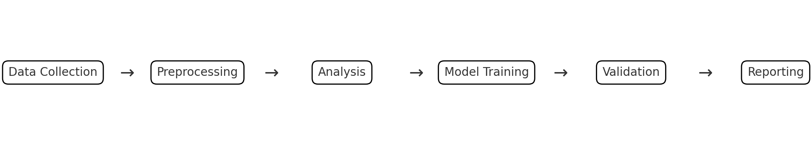

# What are Reproducible Analytical Pipelines?


Reproducible Analytical Pipelines (RAP) refer to a systematic approach in data analysis that emphasizes the reproducibility and reliability of results. This approach is built upon the integration of data gathering, processing, analysis, and reporting into a coherent, automated workflow. By employing tools such as those that we listed previously, RAP ensures that every step of the analytical process can be replicated with the same inputs to produce identical outputs.

As an example or illustration,
suppose you are trying to manage a complex data science workflow
in a research setting. In a finance research setting, 
a data science project often involves several interdependent stages: data collection, preprocessing, analysis, model training, validation, and reporting. Each stage may depend on the output of the previous stages, and the project might include a mix of Python scripts, Jupyter notebooks, and data files in various formats.



In such a multi-faceted environment, RAP plays a pivotal role in maintaining the integrity and consistency of the workflow. For instance, if new data becomes available or if there's a need to modify the analysis model, RAP facilitates the seamless integration of these changes across all stages. This integration is crucial in financial research, where the accuracy and timeliness of insights can significantly impact decision-making and strategy formulation. The automated and structured nature of RAP not only ensures that each step of the process adheres to predefined standards but also allows for easy tracking of changes and quick adaptation to new requirements or data. This agility, coupled with the robustness of reproducible results, makes RAP an indispensable tool in modern quantitative finance research.

## The Business Case for RAP

Within the context of economic statistics and financial regulators, consider this statement by the UK’s Office for Statistics Regulation:

> In 2017 we championed the Reproducible Analytical Pipeline (RAP), a new way of producing official statistics… This approach involved using programming languages to automate manual processes, version control software to robustly manage code and code storage platforms to collaborate, facilitate peer review and publish  analysis… . We consider that RAP principles support all three pillars of the Code of Practice for Statistics: trustworthiness, quality and value. Trustworthiness, by increasing transparency; quality, by reducing the risk of manual errors; and value, by enabling analytical time to be spent adding value for users rather than on menial, repetitive tasks. It is for all of these reasons that we are so passionate about promoting the use of RAP.


The primary problem that RAP addresses is the lack of consistency and replicability in traditional analytical methods. In quantitative finance, decisions based on data analysis have significant financial implications. The traditional approach, often characterized by manual processes and ad-hoc analysis, is prone to errors and inconsistencies, leading to unreliable results. RAP mitigates this risk by:

- **Ensuring Accuracy through Automation**: Automated pipelines reduce the potential for human error in data processing and analysis.
- **Enhancing Transparency through Provenance**: In the context of art or historical artifacts, "provenance" refers to a record of ownership that is used as a guide to authenticity or quality. Within the context of data science, this refers to the practice of making every step in the analysis traceable and repeatable. We want to be able to trace the end results back from the first origins of the raw data. We want to be able to see how each step connects to the previous one. In this way, RAP promotes transparency and accountability.
- **Saving Time and Resources**: Automated processes streamline workflows, reducing the time and resources required for data analysis. This is especially true because the software tools discussed can ensure that, when new data is received or certain changes are made to the code, a task manager will automatically calculate which steps need to be re-run and which steps do not.
- **Facilitating Collaboration**: Version control (e.g., Git) and version control platforms (e.g. GitHub) enables multiple analysts to work on the same project without conflicting changes
and provide better ways for team members to coordinate their efforts.


```{admonition} Discussion
:class: note 
Why might these things be especially important in finance?
```


## Exploring the pipeline. Where can you add value?

In hedge funds or quantitative trading firms, the different business functions might include 

- generation of new investment ideas informed by market analysis and trends, 
- collection of relevant data, data extraction, transformation (ETL process),
- development and maintenance of trading systems,
- building of statistical models,
- risk monitoring,
- and performance evaluation.

I often get the feeling that students focus too much on parts that include building of statistical models. However, the activities of these firms include way more than just the mathematics and statistics. There is a whole collection of efforts that is needed to make the firm successful. I believe that students will be successful if the focus on the big picture and learn how to insert themselves into these other functions. 

```{admonition} Discussion
:class: note 
Think of a financial firm as you would a manufacturing plant? What is the product in this analogy? What are the inputs? What can you do to improve the production line?
```

While statistical modeling is a key aspect of hedge funds and quantitative trading firms, it's just one part of a complex operation. Students often focus on this area due to its clear, quantifiable nature. Yet, excelling in this field requires engaging with all facets of a firm's activities, from idea generation to performance evaluation. Viewing a hedge fund as an interconnected production line helps understand how each function contributes to overall success and where improvements can be made. Students should broaden their skills to include data management, system development, risk analysis, and performance assessment. This not only enhances their versatility but also deepens their understanding of their role in achieving the firm's broader goals. Ultimately, the aim is to not only fit into the system but to understand and improve it, contributing to the firm's success and innovation.

Importantly, this holistic approach underscores the significance of developing reproducible analytical pipelines. Learning to create RAPs will help students to understand these 
sometimes less emphasized aspects of the business functions within quantitative finance, which are crucial as they ensure the accuracy, consistency, and reliability---key factors in an industry where precision and adaptability are paramount. By focusing on RAPs, students not only fit into but also enhance the system, thereby driving innovation and contributing significantly to the firm's success.

## Conclusion

In conclusion, Reproducible Analytical Pipelines represent a fundamental shift in how data analysis is conducted in quantitative finance. By ensuring the reproducibility and reliability of analytical processes, RAP not only addresses the inherent challenges in traditional analysis methods but also significantly contributes to more informed and accurate decision-making in the financial sector.

## References

Here are some other books or course that teach Reproducible Analytical Pipelines

- [The Turing Way: Guide for Reproducible Research](https://the-turing-way.netlify.app/reproducible-research/reproducible-research)
    - I am a big fan of "The Turing Way" and I especially like the care that they put into motivating these principles. See, especially, [here](https://the-turing-way.netlify.app/reproducible-research/overview/overview-definitions) and [here](https://the-turing-way.netlify.app/reproducible-research/overview/overview-barriers).
- [Reproducible Analytical Pipeline Journey](https://datasciencecampus.ons.gov.uk/capability/data-science-campus-faculty/reproducible-analytical-pipeline-journey)
- [Building reproducible analytical pipelines with R](https://raps-with-r.dev/), by Bruno Rodrigues
- ["Building Reproducible Analytical Pipelines" Course](https://rap4mads.eu/)
